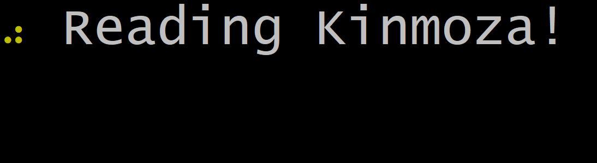

# Kurukuru
[](https://ci.appveyor.com/project/mayuki/kurukuru)

> Terminal Spinner library for .NET Core/Standard. strongly inspired by [cli-spinners](https://github.com/sindresorhus/cli-spinners), [ora](https://github.com/sindresorhus/ora), [CLISpinner](https://github.com/kiliankoe/CLISpinner).



## Features
- Disable spinner automatically when running on a non-interactive context in which stdout is redirected.
- Aware non-Unicode codepage on Windows environment.
    - When running on terminal using non-Unicode codepages (e.g. CP932), the library will render using fallback characters. 
    - fig. Left:Command Prompt (CP932) / Right:mintty (UTF-8 on Linux)<br /> 

## Install

### Package Manager Console
```
Install-Package Kurukuru
```

### **dotnet** command
```
dotnet add package Kurukuru
```


## Usage
Just add `using Kurukuru;` then call `Spinner.Start` with some delegate. 

```csharp
Spinner.Start("Processing...", () =>
{
    Thread.Sleep(1000 * 3);
    
    // MEMO: If you want to show as failed, throw a exception here.
    // throw new Exception("Something went wrong!");
});

Spinner.Start("Stage 1...", spinner =>
{
    Thread.Sleep(1000 * 3);
    spinner.Text = "Stage 2...";
    Thread.Sleep(1000 * 3);
    spinner.Fail("Something went wrong!");
});
```

You can also use async method pattern. Use `StartAsync` method.

```csharp
await Spinner.StartAsync("Processing...", async () =>
{
    await Task.Delay(1000 * 3);
    
    // MEMO: If you want to show as failed, throw a exception here.
    // throw new Exception("Something went wrong!");
});

await Spinner.StartAsync("Stage 1...", async spinner =>
{
    await Task.Delay(1000 * 3);
    spinner.Text = "Stage 2...";
    await Task.Delay(1000 * 3);
    spinner.Fail("Something went wrong!");
});
```

## API
### `Kurukuru.Spinner` class
#### Static Members
- `Start` / `StartAsync`: Create and start new spinner. And it waits specified action.
    - `void Start(string text, Action<Spinner> action, Pattern pattern = null, Pattern fallbackPattern = null)`
    - `void Start(string text, Action<Spinner> action, Pattern pattern = null, Pattern fallbackPattern = null)`
    - `Task StartAsync(string text, Func<Task> action, Pattern pattern = null, Pattern fallbackPattern = null)`
    - `Task StartAsync(string text, Func<Spinner, Task> action, Pattern pattern = null, Pattern fallbackPattern = null)`
        - `text`: a text to display while running action.
        - `action`: a long-running action.
        - `patterns`: Use spinner pattern (see `Patterns` class). Default value is `Patterns.Dot`.
        - `fallbackPattern`: Use spinner pattern if console's codepage is non-Unicode. Default value is `Patterns.Line`.

#### Instance Methods
- `Stop`: Stop spinner and show a result if needed.
    - `Stop(string text = null, string symbol = null, ConsoleColor? color = null)`
    - `Stop(string text, string symbol, ConsoleColor? color, string terminator)`
- `Success`: Show result as ✔ success. (equivalent to `Stop` method)
- `Fail`: Show result as ✖ failure. (equivalent to `Stop` method)
- `Warning`: Show result as ⚠ warning. (equivalent to `Stop` method)
- `Info`: Show result as ℹ information. (equivalent to `Stop` method)

#### Instance Properties
- `Text`: Get or set a text to display while running action.
- `Color`: Get or set a color of the spinner. (not for text)

## Related

- [cli-spinners](https://github.com/sindresorhus/cli-spinners): Spinners for use in the terminal (node.js)
- [ora](https://github.com/sindresorhus/ora): Elegant terminal spinner (node.js)
- [CLISpinner](https://github.com/kiliankoe/CLISpinner): Swifty Terminal Spinner

## License

MIT License.